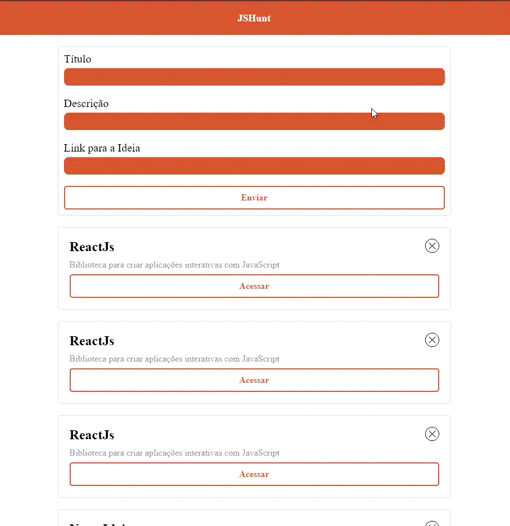

# Rocketseat-starter :rocket:

Repositório responsável por armazenar os desafios e projetos realizados feitos durante o curso "starter" da Rokeatseat

## O que você vai encontrar aqui :book:

- Todos os desafios do curso JavaScript ECS6+
- Api rest desenvolvida no curso de Nodejs
- Aplicação web, integrada com API e com novas funcionalidades feita durante o curso de Reactjs

## JavaScript ES6+ :fire:

Nesse curso eu aprendi como lidar com as features mais avançadas da linguagem JavaScript. Na pasta `javascriptecm6` está presente todos os desafios

- ### Como rodar:
  - Clonar a pasta
  - Executar cada arquivo
- ### Tecnologias utilizadas:
  - Javascript ES6+
  - Babel
  - Webpack

## NodeJs :computer:

Nesse curso aprendi como começar a utilizar o Node, criar a primeira Api e conectar ela ao banco de dados utilizando o docker.
